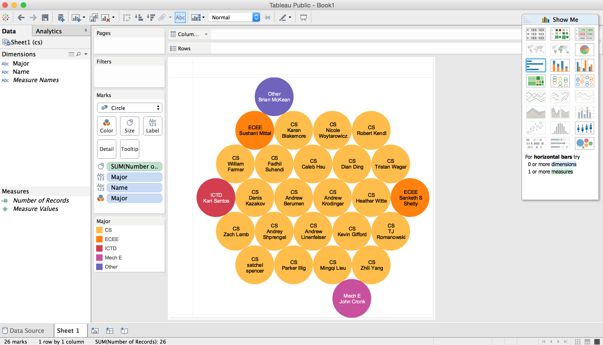
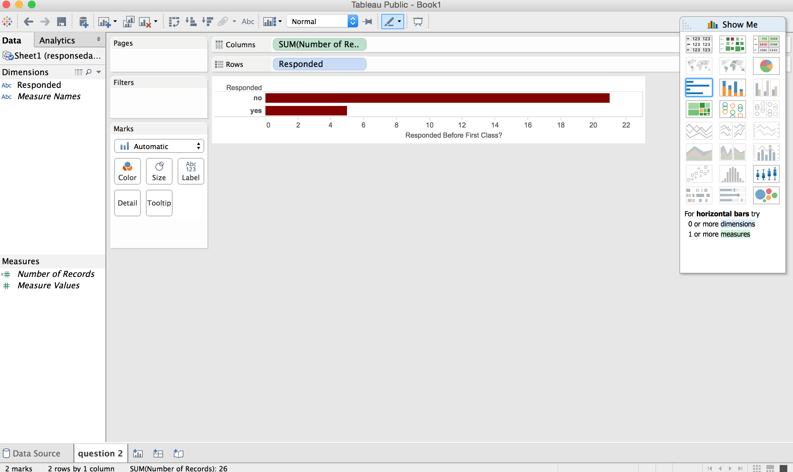
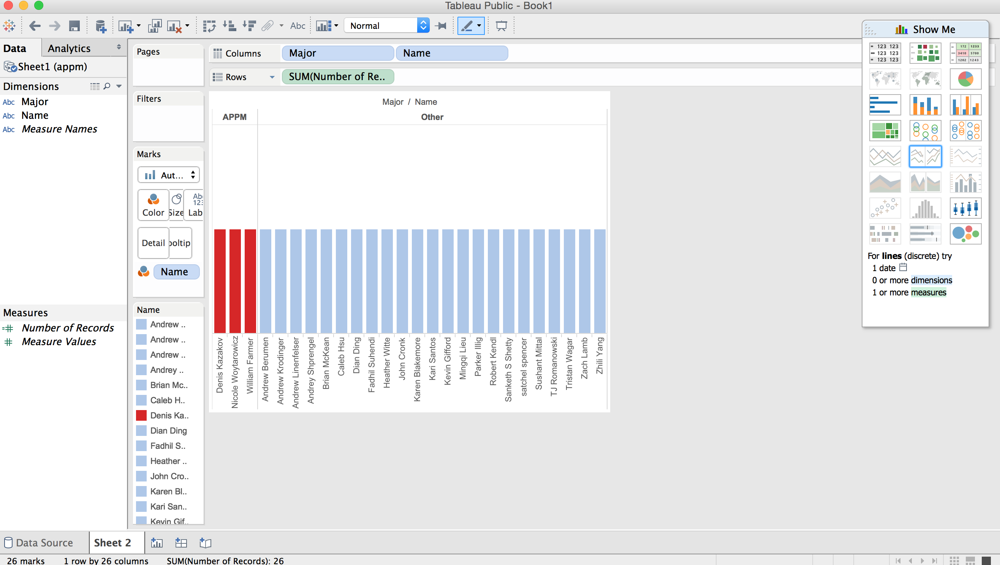
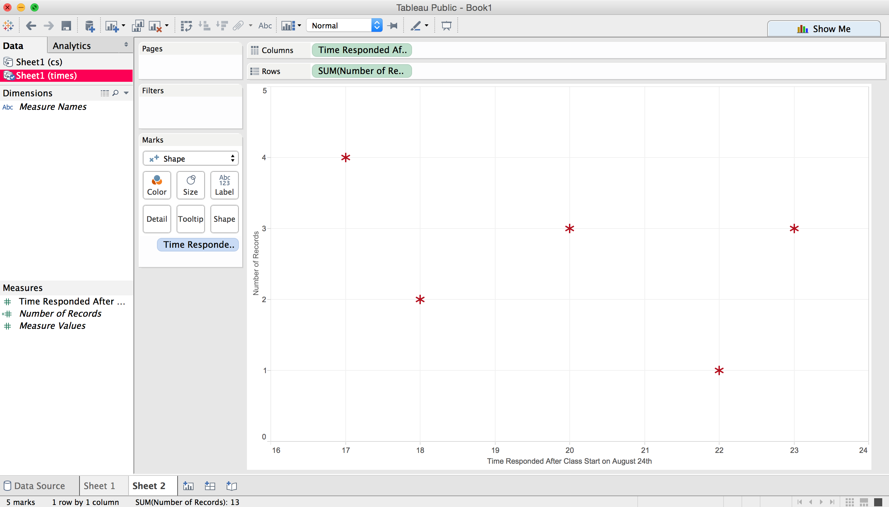

# Tableau Visualization

Tableau is arguably the biggest deal now in terms of data visualization for non-programmers.
Let's pretend you are not a programer. Learn and experience what it is like to make
visualizations using Tableau to answer the same questions about your classmates in our course.

For each of the question, think about what chart you should use to convey your answer and
make your best effort to create something that makes sense to you. There's no right
or wrong. When we meet in the class again, we will set aside time for each team to discuss
and compare the variety of visualization solutions each member has come up with for the
same set of questions. It will be fun!

To include a Tableau visualization in your report, take a screenshot, save it as an image,
put it in the `learning/week2` folder, and replace ``  with
your own image. Please makes sure your screenshot includes the _entire_ Tableau interface
including the controls, widgets ...etc.

# How big the deal Tableau really is?

According to forbes.com, Tableau had 4,400 customers by the end of 2010 and up to 26,000 by the end of 2014, with an estimate of over 60,000 customers projected for the end of 2015. 

# Who is not a Computer Science major?

All the computer science majors in the class are shown in yellow circles and all the people who are not computer science majors are shown inside the other circles along with their majors.

# How many people responded before the first day of class (August 24th)?

The bottom bar shows how many people responded before the first day of class and the top bar shows how many people did not.

# How many people are Applied Math majors?

The APPM majors are shown on the left in red and all other majors are shown on the right in blue.

# How many people responded after class began on the 24th?

A chart showing the hour people responded after class began on the x-axis and the number of people who responded at that time on the y-axis.