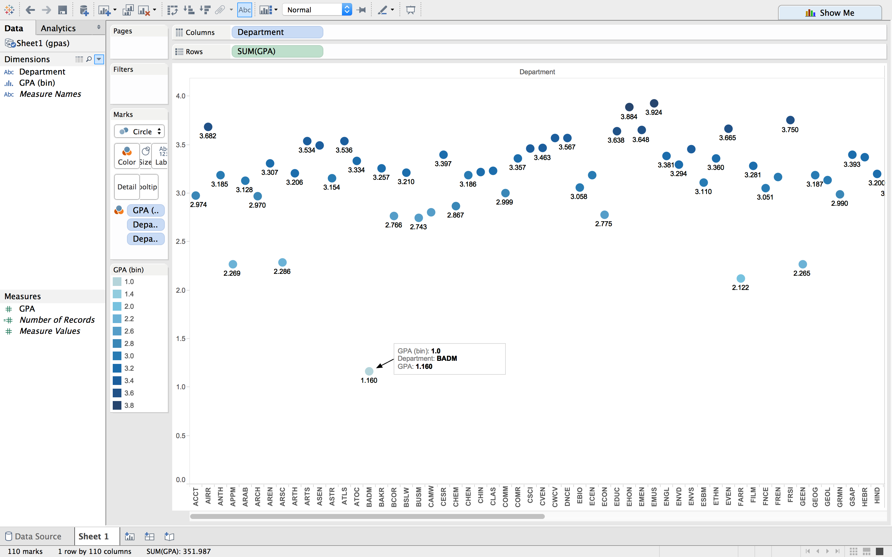
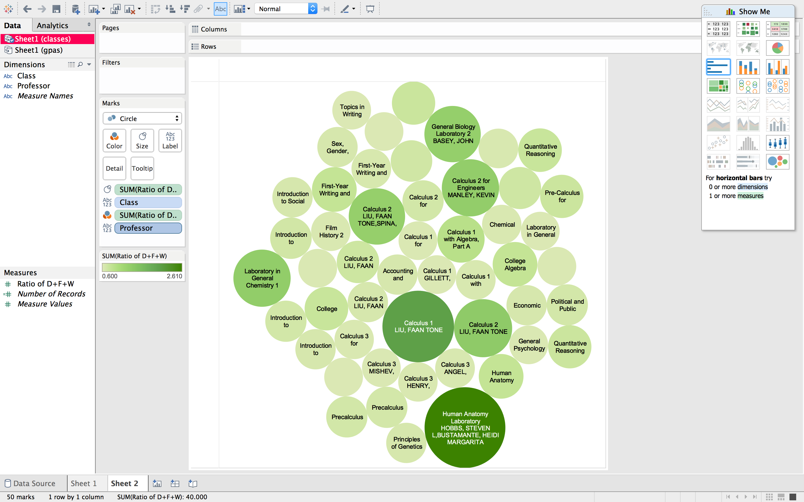
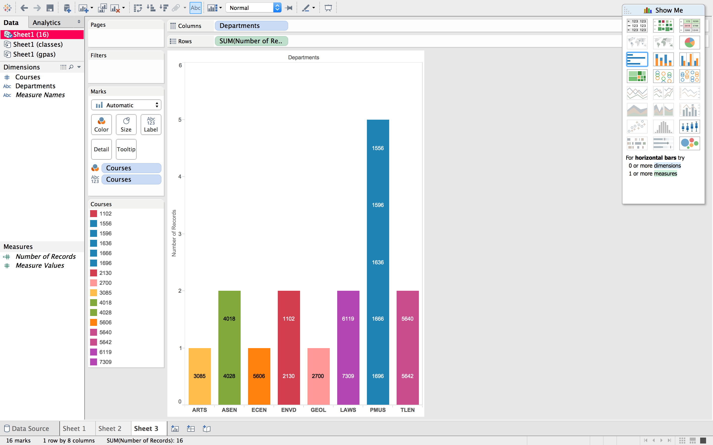
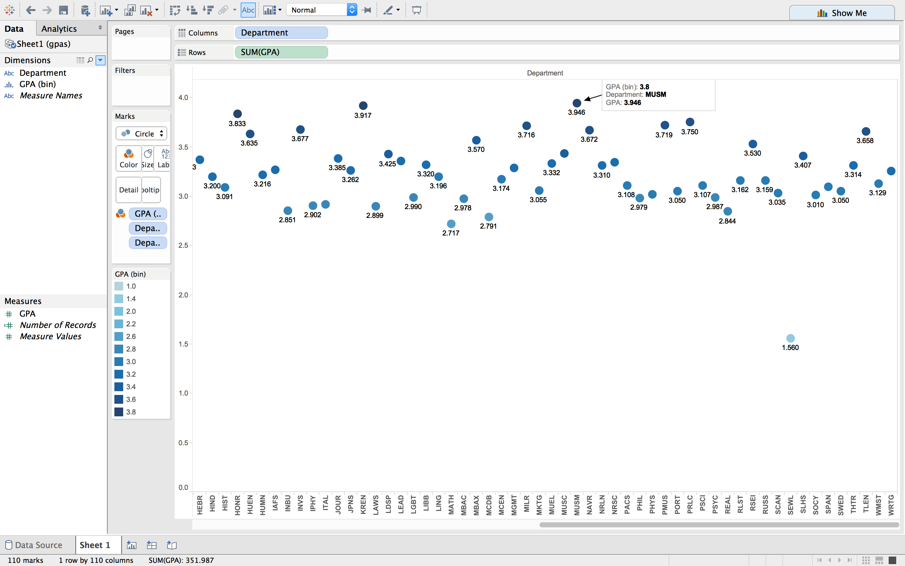

# Visualization

Using Tableau, create visualization for each question in the report. You will
work on this independently just like last week.

To include a Tableau visualization in your report, take a screenshot, save it as an image,
put it in the `learning/week2` folder, and replace ``  with
your own image. Please makes sure your screenshot includes the _entire_ Tableau interface
including the controls, widgets ...etc.

# Import

Data: [fcq.clean.json](https://github.com/bigdatahci2015/book/blob/master/hackathons/fcq/fcq.clean.json)

(a copy of this file is in your book repository already in the directory `hackathons/fcq`)

This dataset is provided to you in the JSON format. Your first task is to figure out
how to transform this JSON file into a format that can be fed into Tableau. As
a junior and senior, you are expected to be able to look around the Internet
to problem solve.

# What department has the lowest average GPA? by Nicole Woytarowicz

A scatter plot of GPAs and their departments with the lowest average departmental (Business Administration) GPA highlighted.

# Which classes(with specific professors) damaged the most students (sort by:D + DF + F + WDRAW rating)? by Denis Kazakov

The classes with the most damaged students are shown with the course name and professor, with the ones with the highest rating shown in the biggest and darkest circles.

# Which classes have the maximum Hours spent (16+) per week? by Parker Illig

The courses with 16+ hours per week are labeled inside the bars and the department they belong to is on the x-axis.

# What should my major be if I want a high GPA? by Caleb Hsu

A scatter plot of GPAs and their departments with the highest average departmental (Museum) GPA highlighted.

# (Question 5)

(write your explanation for the reader as to where to look at this chart in order
    to see the answer)    
